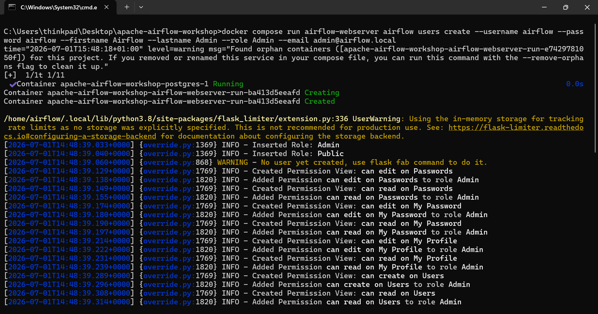
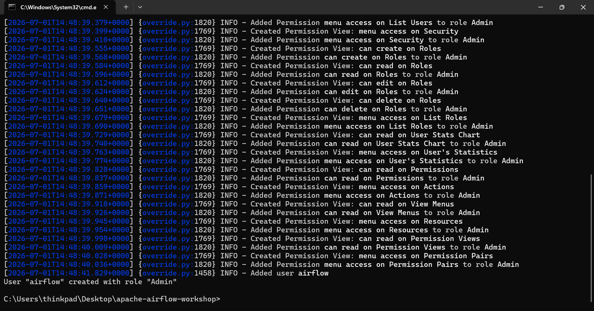
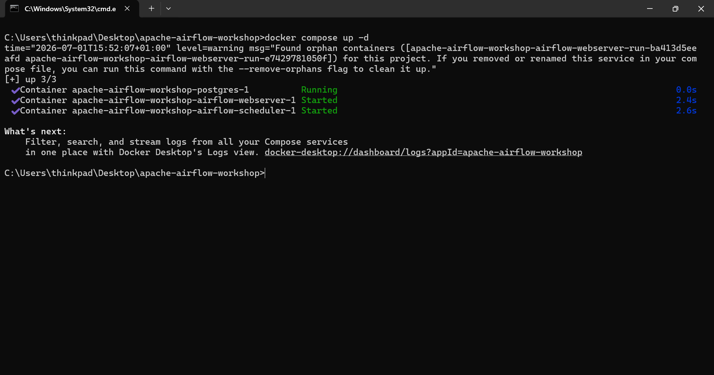
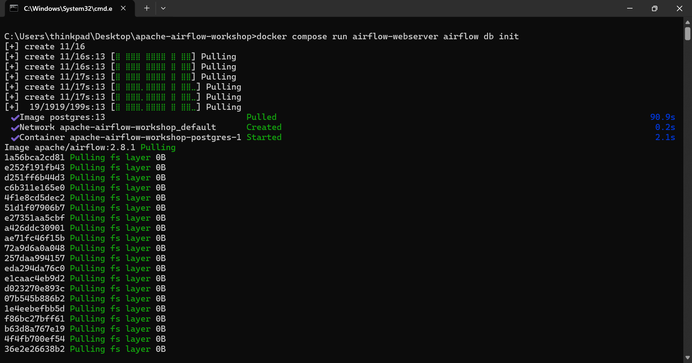
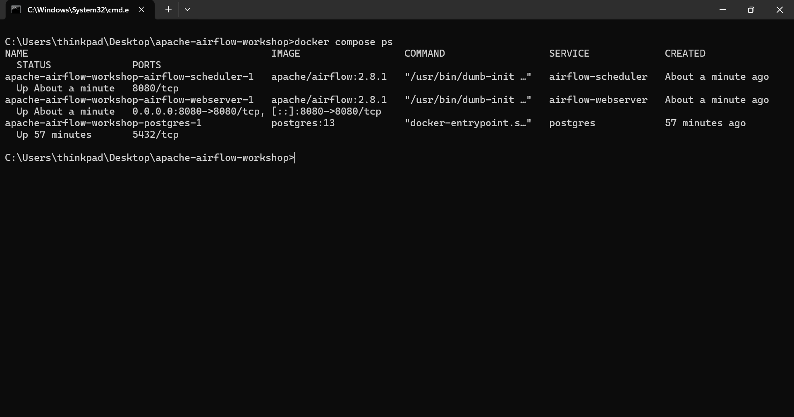
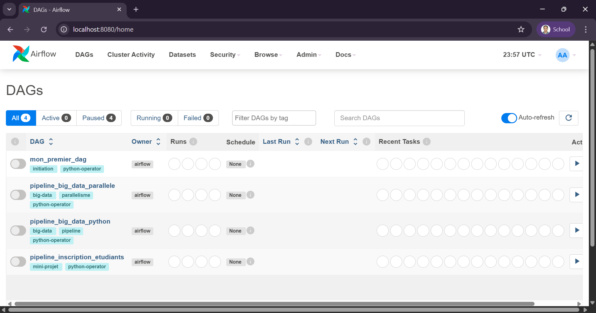
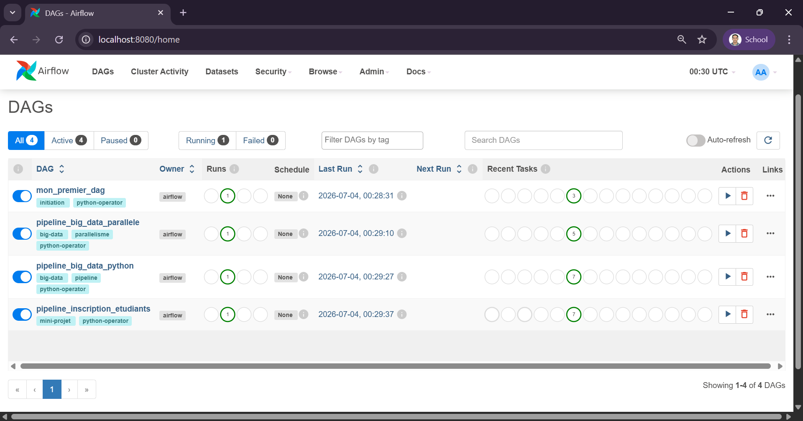
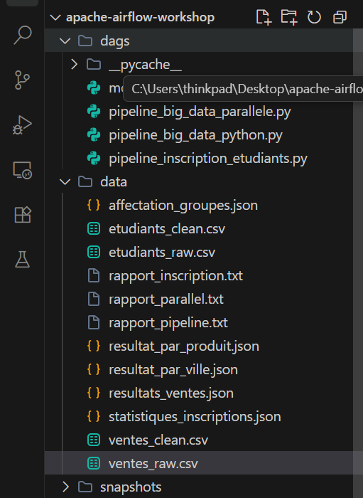

# Atelier Apache Airflow : Orchestration de Pipelines Big Data

**Auteur :** HYNDI ELMEHDI  
**Filière :** II-BDDC  
**Module :** Big Data  
**Outils utilisés :** Docker, Docker Compose, Apache Airflow, PostgreSQL, PythonOperator  

---

## 1. Introduction et Objectifs de l'Atelier

Dans les architectures Big Data modernes, les traitements de données se déroulent en plusieurs étapes interdépendantes (Ingestion, Nettoyage, Transformation, Analyse, Chargement, etc.). Apache Airflow intervient comme le **chef d'orchestre** permettant de modéliser, planifier, exécuter et superviser ces workflows complexes.

L'objectif de cet atelier est de concevoir plusieurs pipelines de données représentés sous forme de **DAGs (Directed Acyclic Graphs)** pour simuler des cas d'usage réels, comme le traitement des ventes et l'inscription des étudiants.

---

## 2. Concepts Clés

* **DAG (Directed Acyclic Graph) :** Un graphe orienté acyclique. Il définit l'enchaînement logique des tâches, leurs dépendances et leur planification sans créer de boucle infinie.
* **Tâche (Task) :** Une unité d'exécution autonome dans le pipeline.
* **Operator :** Un template de tâche. Dans cet atelier, nous utilisons principalement le `PythonOperator` pour exécuter des fonctions Python personnalisées.
* **Scheduler :** Le composant d'Airflow chargé d'ordonnancer l'exécution des tâches selon les dépendances et le calendrier définis.
* **Web UI :** L'interface d'administration visuelle permettant de monitorer et gérer les DAGs.

---

## 3. Architecture et Configuration Docker

Le déploiement d'Apache Airflow s'appuie sur une architecture multi-conteneurs définie dans le fichier `docker-compose.yml` :

1. **`postgres` :** Base de données PostgreSQL pour stocker les métadonnées de fonctionnement d'Airflow (configurations, historiques des tâches, utilisateurs, etc.).
2. **`airflow-webserver` :** Interface utilisateur Web accessible sur le port `8080`.
3. **`airflow-scheduler` :** Processus d'arrière-plan gérant l'ordonnancement et l'affectation des tâches aux workers.

### Volumes Partagés
* Les répertoires locaux `./dags` et `./data` sont montés dans le conteneur respectivement sous `/opt/airflow/dags` et `/opt/airflow/data`, permettant une persistance et un accès direct aux scripts de pipelines et aux données générées.

---

## 4. Initialisation et Lancement de l'Environnement

### Étape 1 : Initialisation de la base de données de métadonnées
```bash
docker compose run airflow-webserver airflow db init
```

### Étape 2 : Création de l'utilisateur Administrateur
```bash
docker compose run airflow-webserver airflow users create \
  --username airflow \
  --password airflow \
  --firstname Airflow \
  --lastname Admin \
  --role Admin \
  --email admin@airflow.local
```



### Étape 3 : Lancement des conteneurs
```bash
docker compose up -d
```



### Étape 4 : Vérification du statut des services
```bash
docker compose ps
```


---

## 5. Présentation des DAGs Développés

Quatre pipelines ont été intégrés et exécutés avec succès dans l'environnement :



### 1. Mon Premier DAG (`mon_premier_dag.py`)
* **But :** Découverte de la syntaxe d'Airflow.
* **Fonctionnement :** Exécution séquentielle simple de 3 tâches (`debut` ➔ `traitement` ➔ `fin`) affichant des logs textes via `PythonOperator`.

### 2. Pipeline Big Data Python (`pipeline_big_data_python.py`)
* **But :** Simuler un flux ETL séquentiel de données de ventes.
* **Fonctionnement :** 
  * Ingestion depuis une source simulée ➔ Stockage Brut ➔ Validation du Schéma ➔ Nettoyage/Calcul du montant ➔ Analyse (chiffre d'affaires par ville) ➔ Chargement final ➔ Génération du rapport de ventes.

### 3. Pipeline Big Data Parallèle (`pipeline_big_data_parallele.py`)
* **But :** Démontrer l'importance et l'implémentation du traitement distribué/parallèle.
* **Fonctionnement :** 
  * Après validation, le workflow se sépare en deux branches parallèles exécutées simultanément : calcul du chiffre d'affaires par ville et calcul par produit. Les résultats sont ensuite fusionnés dans un rapport final commun.

### 4. Mini-Projet : Pipeline Inscription Étudiants (`pipeline_inscription_etudiants.py`)
* **But :** Réalisation complète d'un pipeline d'inscription universitaire complexe.
* **Fonctionnement :**
  1. `reception_fichier` : Simule la génération d'un fichier étudiant brut.
  2. `stockage_zone_brute` : Transfère le fichier étudiant vers la zone brute.
  3. `validation_fichier` : Vérifie la validité des colonnes de données.
  4. `nettoyage_donnees` : Calcule et ajoute une colonne `decision` ("Admis" si note >= 10, sinon "Ajourne").
  5. **Parallélisation** :
     * `affectation_groupes` : Répartit alternativement les étudiants dans le `Groupe_A` ou le `Groupe_B`.
     * `generation_statistiques` : Calcule les indicateurs clés (moyenne, note max, note min, taux de réussite).
  6. `rapport_final` : Génère le bilan final d'inscription au format texte.

---

## 6. Exécution des Pipelines

Tous les DAGs ont été activés et exécutés sans aucune erreur :



---

## 7. Questions de Compréhension du Lab

### Section 6.3 : Pipeline Séquentiel (Ventes)
1. **Quelle est la première tâche exécutée ?**
   * *Réponse :* `ingestion_donnees`, car elle se trouve tout au début du graphe de dépendance (`ingestion >> stockage >> ...`).
2. **Quelle est la dernière tâche exécutée ?**
   * *Réponse :* `generation_rapport`, qui clôture et synthétise le pipeline.
3. **Quelle tâche crée le fichier CSV brut ?**
   * *Réponse :* `ingestion_donnees`, en écrivant les ventes initiales dans le fichier `ventes_raw.csv`.
4. **Quelle tâche vérifie le schéma des données ?**
   * *Réponse :* `validation_donnees`, qui compare l'en-tête du fichier CSV brut aux colonnes attendues `["id_vente", "ville", "produit", "prix", "quantite"]`.
5. **Quelle tâche calcule le chiffre d’affaires par ville ?**
   * *Réponse :* `traitement_analytique`, qui extrait et agrège les indicateurs du dataset nettoyé.
6. **Où peut-on voir les messages affichés par les fonctions Python ?**
   * *Réponse :* Dans les logs de chaque tâche. Sur l'interface Web d'Airflow, cliquez sur la boîte verte d'une tâche exécutée, puis sur le bouton **Log**.

### Section 11.1 : Pipeline Parallèle
1. **Quelles tâches sont exécutées avant le parallélisme ?**
   * *Réponse :* `preparation_donnees` et `validation_donnees`, exécutées de façon linéaire séquentielle.
2. **Quelles tâches peuvent s’exécuter en parallèle ?**
   * *Réponse :* `traitement_par_ville` et `traitement_par_produit`, car elles ne dépendent pas l'une de l'autre et partagent le même parent (`validation_donnees`).
3. **Quelle tâche attend la fin des deux traitements ?**
   * *Réponse :* `generation_rapport_final`.
4. **Comment le parallélisme est-il représenté dans la vue Graph ?**
   * *Réponse :* Par un embranchement visuel (les flèches de `validation_donnees` se divisent vers deux nœuds parallèles, qui convergent ensuite vers le rapport final).

---

## 8. Données et Rapports Générés

À la fin de l'exécution des DAGs, les résultats sont disponibles localement dans le dossier `./data/` :



### Exemple de Rapport Final : Inscriptions Étudiants (`rapport_inscription.txt`)
```text
RAPPORT DES INSCRIPTIONS ETUDIANTS
==================================

Nombre d'etudiants inscrits : 6
Note Moyenne : 12.42/20
Note Maximale : 16.0/20 | Note Minimale : 8.5/20
Taux de reussite : 66.7%

Repartition des groupes :
  - Groupe_A : Ali, Omar, Hamza
  - Groupe_B : Sanaa, Yasmine, Layla
```
